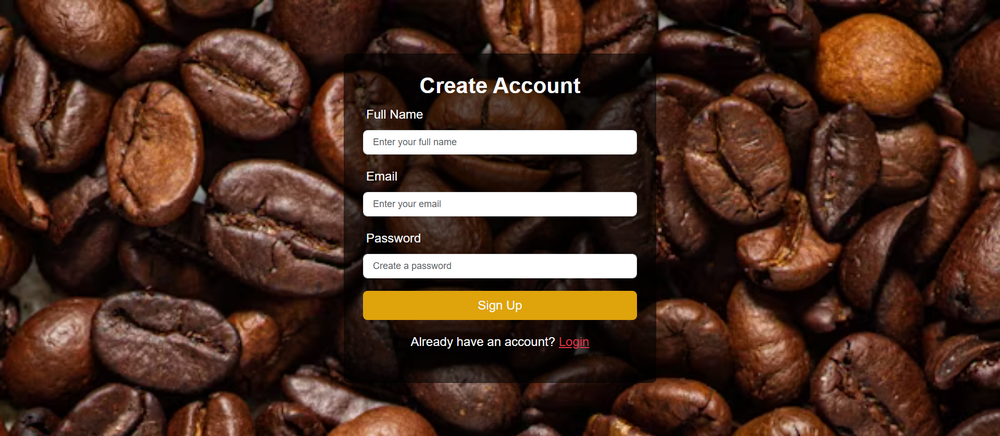
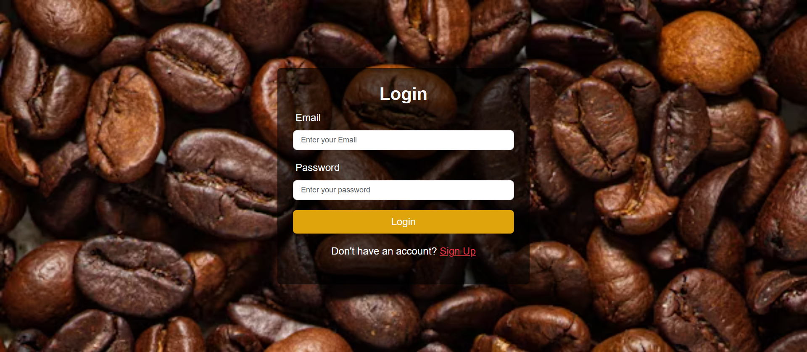
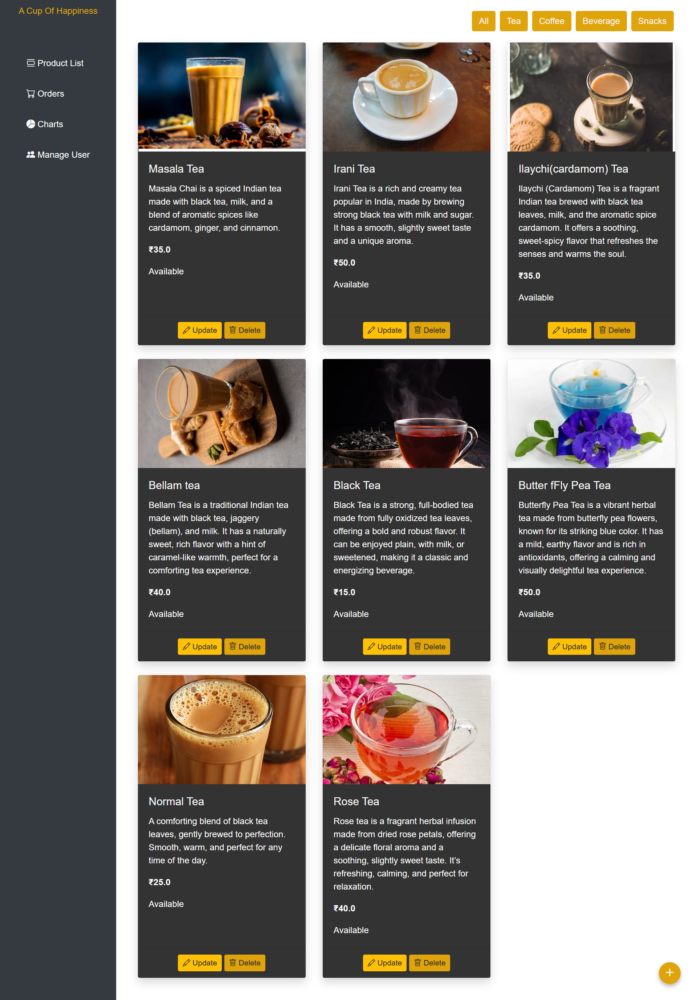
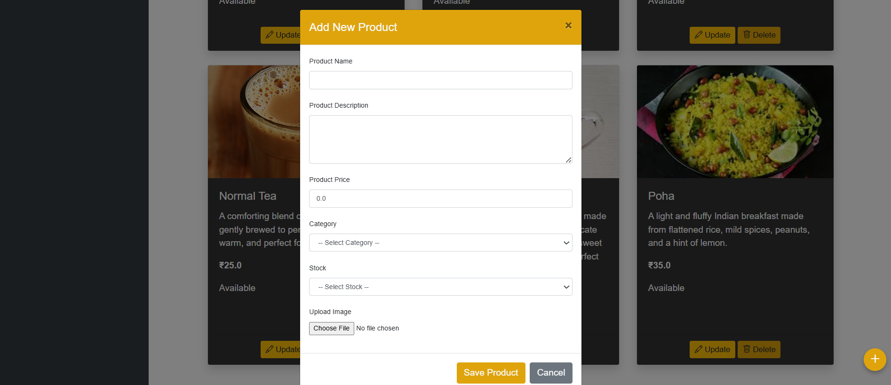
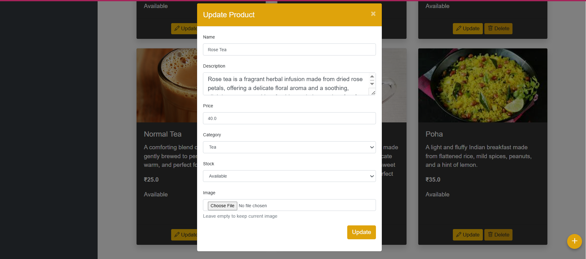
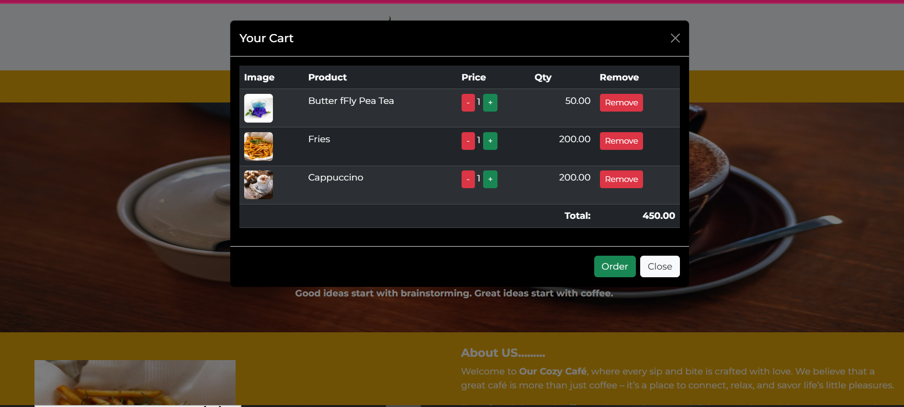

# Cafe Management System (In-Progress)

This is an **in-progress project** for a **Cafe Management System**, demonstrating **role-based login** and core CRUD functionalities for Admin and Customer users.  

The project uses **Spring Boot, Spring Security with JWT, Spring Data JPA, Spring Web MVC, Thymeleaf, MySQL, Bootstrap, AJAX, and jQuery** to build a dynamic and secure web application.  
**All user passwords are securely stored in the database in encrypted form using Spring Security.**

---

## **Technologies Used**
- **Backend:** Spring Boot, Spring Security, Spring Data JPA, Spring Web MVC  
- **Frontend:** Thymeleaf, Bootstrap, AJAX, jQuery  
- **Database:** MySQL  
- **Authentication:** JWT Tokens for secure login, passwords stored encrypted  
- **Build Tool:** Maven  

---

## **Project Features (In-Progress)**
- **Role-based login:** Separate access for **Admin** and **Customer**
- - **Secure password storage** using encryption (Spring Security)  
- **JWT token generation for authenticated users** 
- **CRUD operations for products (Admin side)**  
- **Dynamic Cart Management (Customer side)**:
      - Add/Remove products to cart dynamically
      - Manage product quantity with increase/decrease buttons
      - Live total calculation in cart modal 
- **Order Placement Flow**:
      - Place order directly from the cart
      - Orders saved to the database with quantity and bill details
      - Cart automatically cleared after successful order
      - SweetAlert2 popups for order confirmation & error handling 
- Responsive UI with Bootstrap
- Pages rendered dynamically with **Thymeleaf templates**  

---

## **Learning Outcomes**
- Implementing **Spring Security with JWT** for secure role-based access  
- Understanding **Spring Data JPA entity mapping and MVC architecture**  
- Using **Thymeleaf** for dynamic front-end rendering  
- Making asynchronous calls using **AJAX and jQuery**  
- Connecting backend with **MySQL database** for CRUD operations
- Integrating SweetAlert2 for user-friendly notifications 
- Ensuring **secure password storage and authentication**  

---

## **Screenshots**
### User Registration

### User Login Page

### Admin Login

### Add Product Form

### Update Product Form

### Customer Page

### About Page

### Add To Cart

### Orders Bills
[!Orders Bills](Screenshots/Order.png)](screenshots/Order.png)

### Order Placed
[!Order Placed](Screenshots/OrderPlaced.png)](screenshots/OrderPlaced.png)

